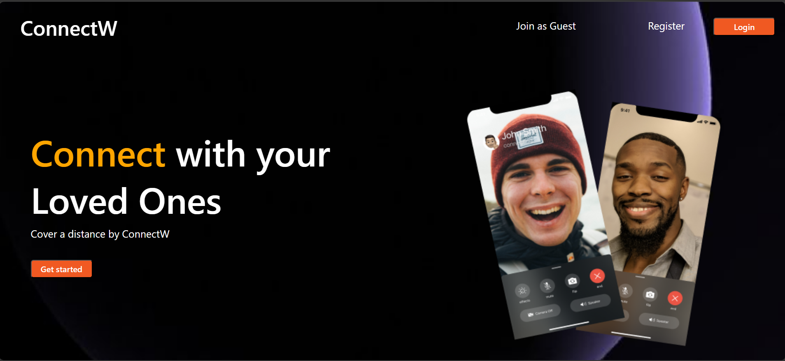
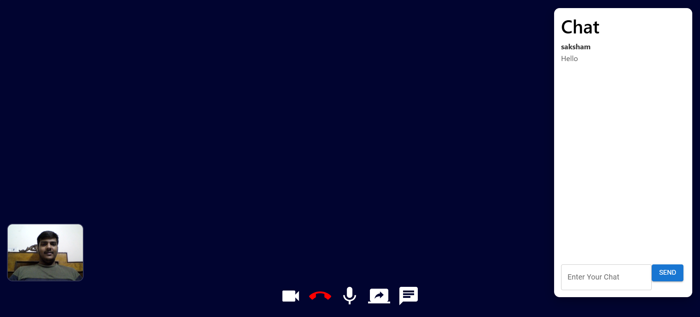
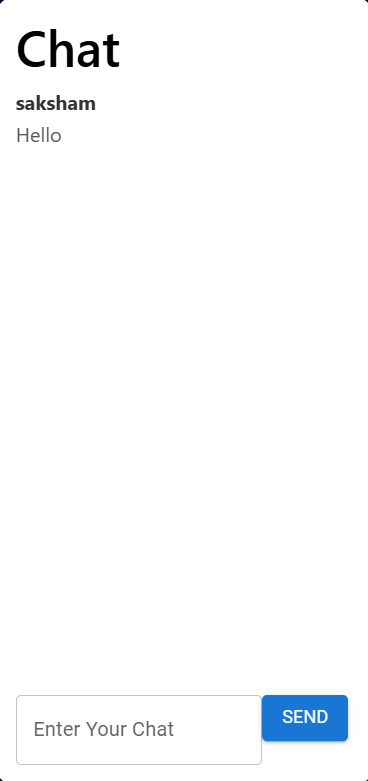
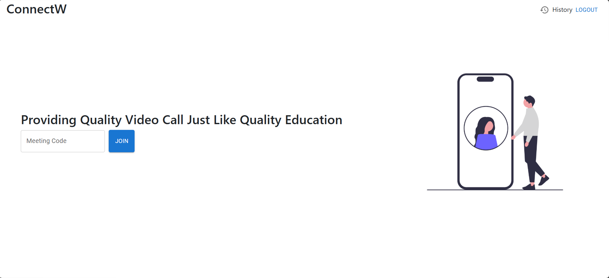

# 📹 ConnectW

A full-stack real-time video conferencing platform that enables users to create secure meeting rooms, communicate through video/audio, chat instantly, and share their screens. Built using the MERN stack with WebRTC and Socket.IO for seamless real-time communication.

---

## ✨ Features

- 🎥 Real-time Video Calling
- 🎤 Audio Calling
- 💬 Live Chat
- 🖥️ Screen Sharing
- 👥 Join Meetings using Meeting ID
- ⚡ Low-latency communication using WebRTC
- 🔄 Real-time messaging with Socket.IO

---

## 🛠️ Tech Stack

### Frontend
- React.js
- HTML5
- CSS3

### Backend
- Node.js
- Express.js

### Database
- MongoDB

### Real-Time Communication
- WebRTC
- Socket.IO

---

## 📂 Project Structure

```
ConnectW
│
├── frontend
│   ├── src
│   └── public
│
├── backend
│   ├── src
│   ├── controllers
│   ├── routes
│   ├── models
│   └── app.js
│
├── README.md
└── package.json
```

---

## 🚀 Installation

### Clone the Repository

```bash
git clone https://github.com/sakshamg1152/ConnectW.git
```

### Install Dependencies

Frontend

```bash
cd frontend
npm install
```

Backend

```bash
cd backend
npm install
```

### Start Backend

```bash
npm start
```

### Start Frontend

```bash
npm run dev
```

---

## 📸 Screenshots









---

## 📌 Future Improvements

- Authentication & Authorization
- Meeting Recording
- File Sharing
- Responsive UI Improvements
- Meeting Scheduling

---

## 👨‍💻 Author

**Saksham Gupta**

- GitHub: https://github.com/sakshamg1152
- LinkedIn: https://www.linkedin.com/in/saksham-gupta-5299053a2
